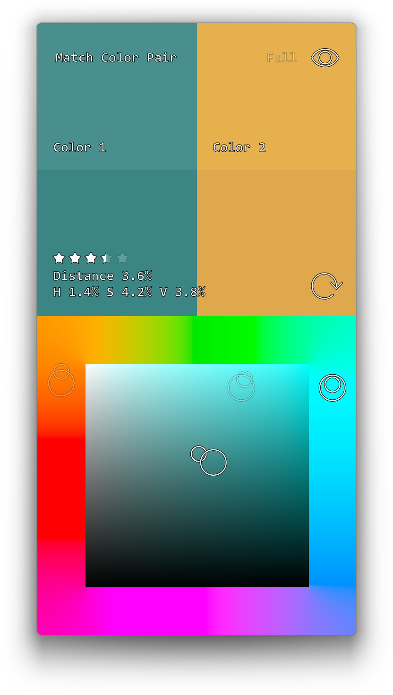

<h1 align="center">
<a href="https://ytt0.github.io/okcolor-game"></img></a>
 
Okcolor Game
</h1>

A simple mobile game, that uses the [Oklab](https://bottosson.github.io/posts/oklab/) color space, for practicing color perception and memorization. The game has different modes, with various difficulty levels.

  <a href="https://ytt0.github.io/okcolor-game">
    ytt0.github.io/okcolor-game
     
    
  </a>

The game is built as a single page application, and can be added from the browser menu as a local app in Android and Windows.
